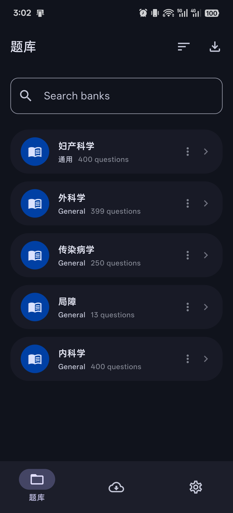
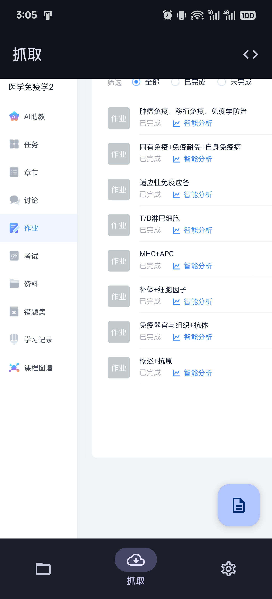
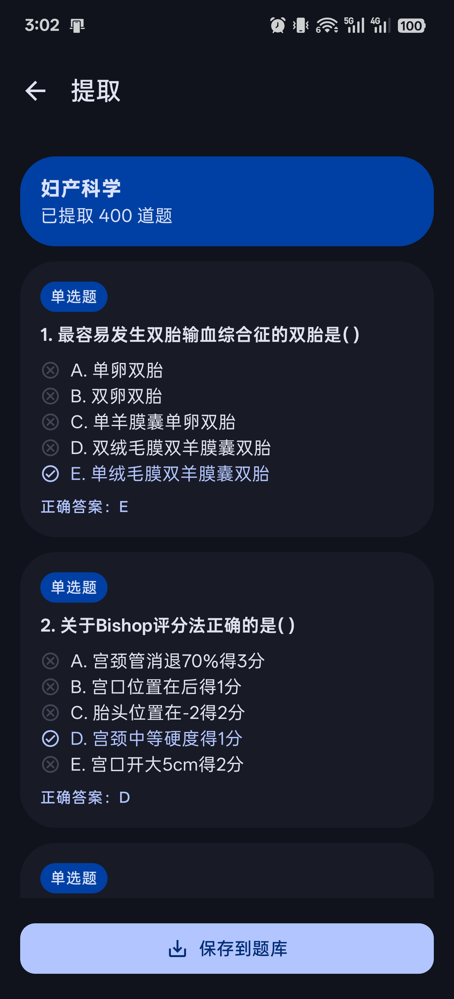
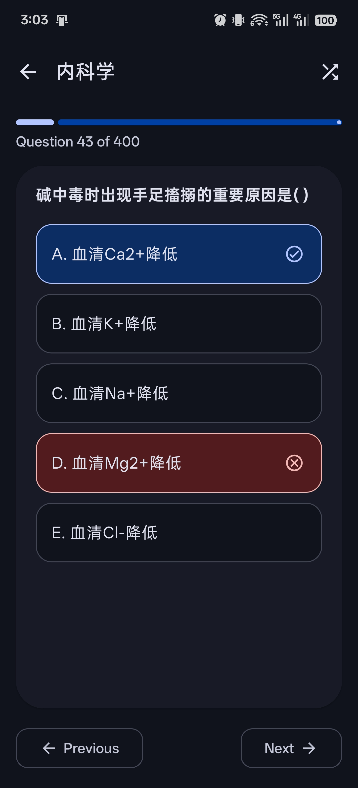

# NekoMemo

NekoMemo 是一款背题软件，可从学习通网页提取题库，帮助背题练习喵~

## 功能特性

- **网页提取 (Fetcher)**：从学习通网页中解析并提取题库
- **多题型支持**：单选题、多选题、判断题自动识别和提取
- **题库管理**：组织并管理多个题库，支持分类、搜索、排序
- **练习模式**：简洁的界面，支持测试全部或部分题目，支持打乱题目或选项
- **错题本**：自动记录答错的题目，支持标记已掌握，方便重点复习
- **测试历史**：记录每次测试的成绩、正确率、用时等统计信息
- **导入/导出**：备份题库或与他人分享
- **Material 3**：支持浅色/深色主题，跟随系统设置

## 截图

 
 

## 使用说明

1. 在题库页右上角加号，从学习通抓取
2. 登录学习通，找到课程的作业详情页面
3. 点击右下角按钮，提取题目
4. 保存到题库
5. 回到题库页，刷题测试喵~
6. 底部导航栏可查看错题本，复习答错的题目

## 更新日志

### v1.3
- 支持多选题、判断题的提取和练习
- 新增错题本功能，自动记录答错题目
- 新增测试历史记录
- 底部导航栏新增错题本入口
- 更换全新应用图标

### v1.2
- 支持题库分类管理
- 支持导入/导出题库
- 优化测试界面交互

## 许可协议
    Copyright 2026 JamGmilk
    MIT License
